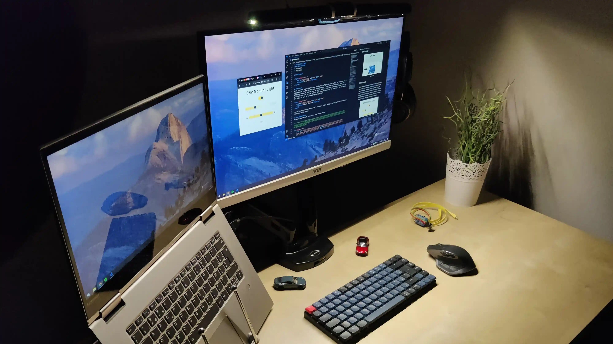
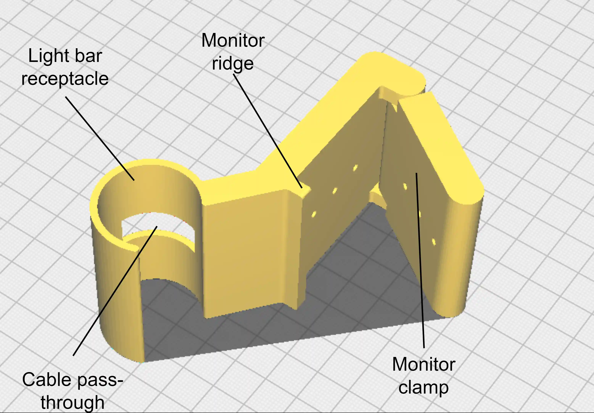
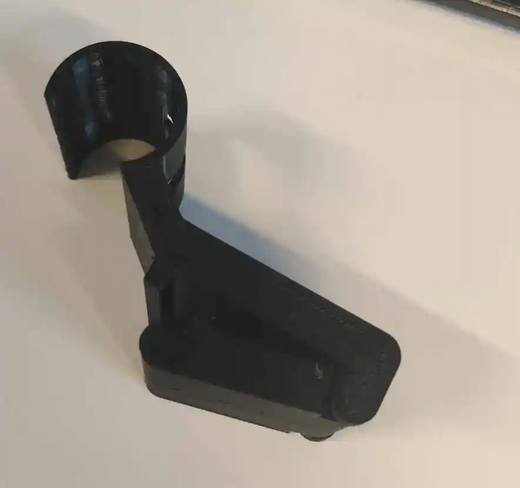

# DIY ESP32 based Monitor Light

<p align="center">
    
    </p>
<p align="center">
    <em>DIY Monitor Light</em>
</p>

## About
Having a desk light on a small desktop can a little cumbersome: when it is not in use, the space it occupies is wasted, the light repartition is uneven (especially with a laptop on the side + its monitor(s)) and an additional wall socket is probably needed. Recent monitor light bars help to mitigate those issues by being powered through USB, positioned above the monitor and at the center of the desk so that the light can be evenly distributed. However, such lights can often be quite expensive or lacking in quality/functionalities. Often, you would need a remote, or the color temperature cannot be changed. Such lights consist of a LED strip, some electronics components, a microcontroller and some 3D printed parts. So, why not go with the DIY route? To control the light, a webserver would allow any device to take control of the light.

This project is only a prototype and in no way a finished product. As such, I can't garantee that your implementation of the device will work as expected. Make sure to refer to the improvements sections to know learn can be improved from this first design. Of course, you can take inspiration from this project to create your own DIY monitor light bar and improve on this first draft.
## Specifications

* Wide range of color temperature
* High brightness
* Good quality LED strip (CRI > 95)
* Controllable through a web server
* 5V USB powered
* Placed on top of monitor
* Easy to use
* Asymmetric lighting

## Material needed
* 40cm 5V CRI>95 CCT White LED strip (such as [this one](https://www.befr.ebay.be/itm/325307969233?_skw=CRI+cct+5v&itmmeta=01J8DMVBZCJF9ZTSHXPQQX7Z6D&hash=item4bbdddaed1:g:1UMAAOSwx8Bi~LUt&itmprp=enc%3AAQAJAAAA0HoV3kP08IDx%2BKZ9MfhVJKmXxlM%2Fa%2FsjAggVvWnOiLN34x1sj2Mexd8c0sUytNDJuiFI5blNDtBPJYqgpPpHQqjXpk0NzoxupLGiiL3DkhseVxo%2BexQW1bEwWwIC59mGgsz2jLxyWUmVYC9YoClJ1LGD5KuruplvjBiGGZg0wB2ZetFW0bOoss%2F0v5xUuwpJh14fELQFtHq34s3K2suUtXqhN3ZVMyvyUMTUO6HsVcD%2Fy9iBzwYxHvmzsvvtfmewxvRRBV3zM03o23JfmsGuTT4%3D%7Ctkp%3ABk9SR-C_7bTDZA))
* ESP32 micro-controller (not ESP 8266) ([used in this project](https://www.seeedstudio.com/Seeed-XIAO-ESP32C3-p-5431.html))
* 3x 100-200 &#8486; resistors
* 6x MOSFETs (FQP30N06L were used for this project but others can work too)
* Jumper cables
* Breadboard for testing
* Perfboard/stripboard

## Skills involved
* Electronics
* Soldering
* Programming
* Micro-controllers (Arduino/ESP32)
* Web servers
* 3D modeling
* 3D printing

## Electronics
To control the light with the analog LED strips chosen, the voltage needs to be regulated. MOSFETs are the perfect candidate to modulate/regulate the LEDs' voltage: there should be only two MOSFETs if we have 5V at the gates. However, this project uses an ESP 32 microcontroller whose output voltage is 3.3V. As the LEDs are rated for a maximum voltage of 5V, using only two MOSFETs with 3.3V at the gates means we would not be able to use the maximum capacity of the LED strips. As such, we use two more MOSFETs (see circuits pictures below): with two MOSFETs regulating the a 5V signal, we have 5V at the gates of the LEDs' MOSFETs, which allows to use all the capacity of the LEDs. This configuration means that when the microcontroller sends a signal of 0V through its PWM signal, the first MOSFET is completely open, which allows the 5V to flow through and to have the LEDs at maximum brightness. When the microcontroller outputs 3.3V through its PWM signal, the 5V does not flow through the MOSFET and the LEDs are off. This inverted behavior needs to be reflected in the code.

Below one will find the circuit schematic and diagram. Notice that the pictures use a Arduino Uno instead of a ESP32 as the library used to make these pictures ([Tinkercad](https://www.tinkercad.com/)) did not offer ESP32. One will also notice that the signals to the MOSFETs from the microcontroller are connected to PWM ports: this is crucial in order to add the granularity to the LEDs' brightness control.

It should be noted that this project has been done using ESP32 in order to have a webserver interface. However, an Arduino Uno or Nano should suffice if a web server is not needed in your usage and you want to control the light through the Serial communication.

For this project, the ESP8266 will not work as the Wi-Fi interferes with the pins, creating a flickering light. However, it can be used if you control the light using the Serial communication. It is thus best to use a ESP32 to get the most out of this monitor light.

<p align="center">
    
    </p>
<p align="center">
    <em>The circuit schematic</em>
</p>
<p align="center">
    
    </p>
<p align="center">
    <em>The circuit diagram</em>
</p>

## Code
The code used in this project in available in the src folder. The file is in the format .ino and has been created using the [Arduino IDE](https://www.arduino.cc/en/software) v2.3.3. The code has been inspired by [this article](https://randomnerdtutorials.com/esp32-web-server-slider-pwm/) : you can follow its tutorial for more information about the inner workings of the code and how to deploy it on the micro controller. You need to specify you Wi-Fi SSID and password in the file ```src.ino```.

The code can be separated in two parts: the front-end and the back-end. The front-end is the web interface which talks to the back-end. The back-ends controls the LEDs through the MOSFETs.

### Backend
The back-end API consists of these endpoints:
* blink: when the light is on, turns off the light during 250ms; when the light is off, does nothing.
```
Mode: GET
Params: None
```
* brightnessAdd: Increments the brightness by a value.
```
Mode: PUT
Params: {
    value: int
}
```
* colorAdd: Increments the brightness by a value.
```
Mode: PUT
Params: {
    value: int
}
```
* getSettings: Gets the brightness, color temperature and state (on/off) values of the light.
```
Mode: GET
Params : None
Response: {
    toggleState: int,
    colorLevel: int,
    brightnessLevel: int
}
```
* setSettings: Sets the light by its brightness and color temperature.
```
Mode: PUT
Params : {
    color: int,
    brightness: int
}
```

* toggle: toggle the lights on/off
```
Mode: PUT
Params: None
```

The backend also allows control through the Serial port. An "animation" for smooth light transitions has also been added.

### Frontend (web server)
A web interface is provided to change the light's configuration very easily. The interface has a toggle button, a slider for the color temperature and a slider for the brightness. Using the brightness slider, in order to keep the slider logical, it has been configured so that it is not possible to have both the warm and cold LEDs at max brightness at the same time: the max button thus allows to have the maximum brightness possible.

<p align="center">
    
    </p>
<p align="center">
    <em>The web interface</em>
</p>

The web interface has been built using a responsive design, making it easily usable on both desktop clients and mobile clients. To install the frontend, you need to use the filesystem of the ESP32 : this has been done using [LittleFS](https://github.com/earlephilhower/arduino-littlefs-upload?tab=readme-ov-file). You can use the tutorial provided in the [GitHub repo](https://github.com/earlephilhower/arduino-littlefs-upload?tab=readme-ov-file) or[ this tutorial](https://randomnerdtutorials.com/esp32-littlefs-arduino-ide/) to install LittleFS on Arduino 2.x.x.

## 3D Design and printing
The objective of the design is to replicate the shape of an existing monitor light to have asymmetric light. Thankfully, some manufacturers provide pictures of the shape of the wall on which the light will reflect to in order to create the asymmetric light. This asymmetric light allows to concentrate all the light on the desk without reflection on the monitor's surface.

The light bar has been divided in two in order to accommodate for the smaller size of 3D printers and to allow inserting the PCB inside the bar. As such, the final product comes in three pieces: the left part of the bar, the right part of the bar and the base allowing the bar to stand on a monitor. The base includes a mechanism to "pinch" the monitor so that the bar stands on its own above the monitor.

### The base
On the following picture can you find the base. Notable features of the model are the receptacle for the light bar, a hole to pass cable through, a ridge to stand on the monitor, a clamp to pinch the screen in order for the light to stay in place and holes to pass rubber bands/threads in to create the pinching mechanism of the clamp.

<p align="center">
    
    </p>
<p align="center">
    <em>3D model of the base</em>
</p>

The base has been printed in the orientation shown on the picture. The pinching mechanism is printed in place. No special setting has been used to print the part.

### The bar
On the following picture can be found the left part of the bar. Notable features of the model are the slope to accommodate the light reflection, the space to welcome the LED strip, interlocking pins to snap the two bar halves together, and a hole to pass the cables by.

<p align="center">
    
    </p>
<p align="center">
    <em>3D model of the bar</em>
</p>

The base has been printed in the orientation shown on the picture. Make sure to print slowly in order to avoid the part from tipping over during impression.

## Google Chrome extension
This repository adds a Chrome extension based on the web interface: the interface is shown as a small window by clicking on the extension's icon. This Chrome extension is useful to add keyboard shortcuts to control the light and to have the web interface quickly accessible. The following image shows an example configuration of keyboard shortcuts.

<p align="center">
    
    </p>
<p align="center">
    <em>Chrome shortcuts</em>
</p>

Before installing, you need to specify your ESP32 light's URL in ```background.js``` and ```script.js```. To install the Chrome extension, please refer to [this official guide](https://developer.chrome.com/docs/extensions/get-started/tutorial/hello-world#load-unpacked). 
To change the keyboard settings, head to the upper left corner to find the keyboards shortcuts menu as seen in the picture above.

## Assembled (more pictures)
Here are some pics of the light assembled.

<p align="center">
     
    </p>
<p align="center">
    <em>The base after impression, with the clamp open (left) and closed (right)</em>
</p>

<p align="center">
     
    </p>
<p align="center">
    <em>The light bar installed on the monitor, off (right) and off (left), with focus on the reflection wall</em>
</p>

<p align="center">
     
    </p>
<p align="center">
    <em>Light on, at medium brightness in a pitch-black room, on coldest color temperature (left) and warmest color temperature (right)</em>
</p>
<p align="center">
    
    </p>
<p align="center">
    <em>The light at max brightness in a pitch black room (ideal for hands-on projects)(cold and warm LEDs both at max level)</em>
</p>
<p align="center">
      
    </p>
<p align="center">
    <em>On the left, the asymmetric light repartition. On the right, the (ugly) back side (counterweight, adhesive and electronics).</em>
</p>

## Improvements
This project is a good prototype and proof-of-concept. However, to suit as many users as possible, the project can be improved in a few areas:
### Fixes
* Electronics: a little flicker is present when the LEDs are off but the USB power source is connected (a few capacitors could fix that?).
* The current 3D model has a design flaw: the clamp is print in-place but after printing, the moving part was soldered with the rest of the model.
* Improve the 3D model for a better clamping mechanism. Could involve using a combination of PLA and TPU as 3D printing materials, create ridges for rubber bands to slide into in order to increase the clamping force, create a bigger surface in contact with the back of the monitor. A better weight distribution between the front and back of the monitor could also help.
### Enhancements
* Using magnets to hold the bar: would decrease the reliability on the printer's settings for a good grip between the support and the bar.
* The use of WebSocket in the web server for a better synchronization between the lights and the web server. Web sockets would also allow to synchronize the instances on different devices.
* Use the EEPROM to save the startup settings.
* Implementation of favorite profiles (and/or startup profile) saved using the EEPROM.
* Dark mode for web interface.
* Captive portal and Wi-Fi settings for a no-code implementation.
* Add MQTT support for a better integration with smart home systems like Home Assistant.
* Add presence detection sensor (like LD2410C) to turn on/off the light automatically. Could be used with external software (like Home Assistant) to turn on/off the computer's screen.
* Add light sensor to adapt the light's intensity with relation to the ambient light.
* Add LEDs in the back of the monitor as an ambient light to ease the computer's use on the eyes.


## Authors & contributors

The original setup of this repository is by [Benoît Vidotto](https://github.com/bvidotto).

## License

MIT License

Copyright (c) 2024 Benoît Vidotto

Permission is hereby granted, free of charge, to any person obtaining a copy
of this software and associated documentation files (the "Software"), to deal
in the Software without restriction, including without limitation the rights
to use, copy, modify, merge, publish, distribute, sublicense, and/or sell
copies of the Software, and to permit persons to whom the Software is
furnished to do so, subject to the following conditions:

The above copyright notice and this permission notice shall be included in all
copies or substantial portions of the Software.

THE SOFTWARE IS PROVIDED "AS IS", WITHOUT WARRANTY OF ANY KIND, EXPRESS OR
IMPLIED, INCLUDING BUT NOT LIMITED TO THE WARRANTIES OF MERCHANTABILITY,
FITNESS FOR A PARTICULAR PURPOSE AND NONINFRINGEMENT. IN NO EVENT SHALL THE
AUTHORS OR COPYRIGHT HOLDERS BE LIABLE FOR ANY CLAIM, DAMAGES OR OTHER
LIABILITY, WHETHER IN AN ACTION OF CONTRACT, TORT OR OTHERWISE, ARISING FROM,
OUT OF OR IN CONNECTION WITH THE SOFTWARE OR THE USE OR OTHER DEALINGS IN THE
SOFTWARE.